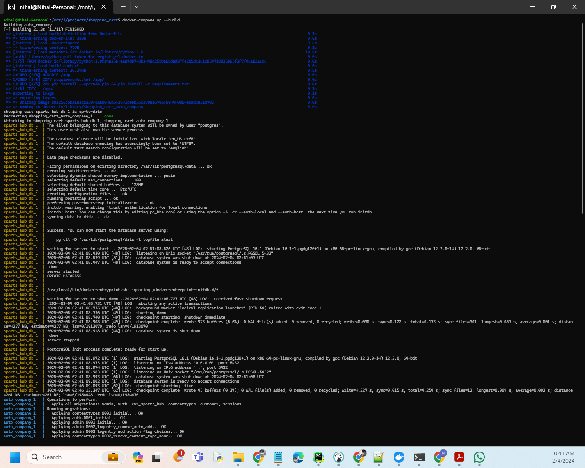
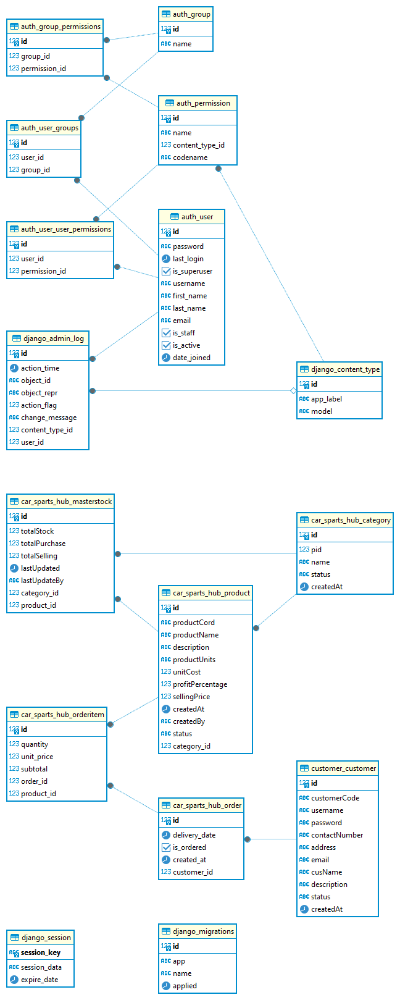
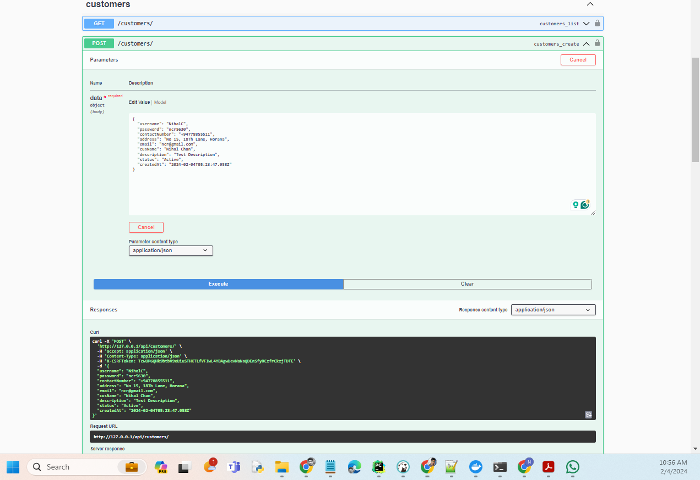
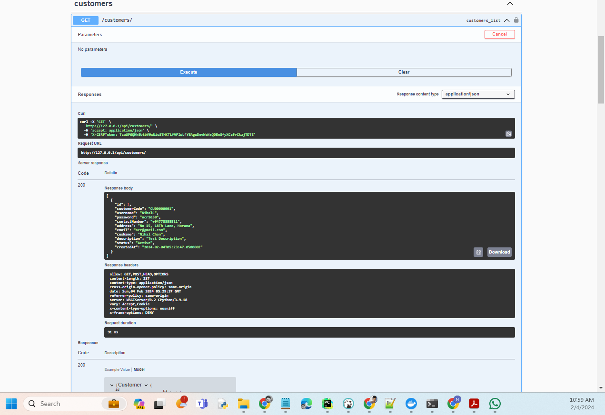
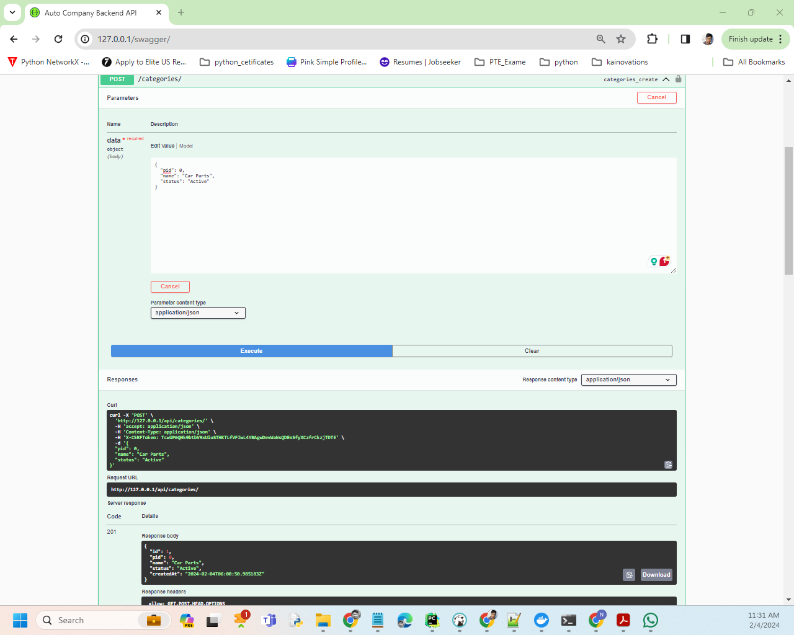

# Auto Company Backend API

## Description

This is the backend API for a Auto Company system. It provides endpoints for managing categories, customers, products, master stock, orders, and order items.

## Setup

**1. Clone the repository:**

   ```bash
   git clone  https://github.com/ncr5630/auto-company-backend
   cd auto-company-backend
   ```
**2. build and run service:**
   ```bash
   docker-compose up --build
   ```


**3. Check if the database tables should be as follows:**


### API Documentation
http://127.0.0.1:8000/swagger/  

**5. create sample customer**


**6. get sample customer**
   
   ***we can do other CRUD operation for customer***


**5. create root category**

   ```bash
   curl -X 'POST' \
  'http://127.0.0.1/api/categories/' \
  -H 'accept: application/json' \
  -H 'Content-Type: application/json' \
  -H 'X-CSRFToken: TcwUP6QHk9btbV9xUiuSTHKTLfVFIwL4YBAgwDevWaNsQDEnSfyXCzfrCkzjTDTE' \
  -d '{
  "pid": 0,
  "name": "Car Parts",
  "status": "Active"
}'
   ```

**5. create sample category under root**

   ```bash
   curl -X 'POST' \
     'http://127.0.0.1/api/categories/' \
     -H 'accept: application/json' \
     -H 'Content-Type: application/json' \
     -H 'X-CSRFToken: TcwUP6QHk9btbV9xUiuSTHKTLfVFIwL4YBAgwDevWaNsQDEnSfyXCzfrCkzjTDTE' \
     -d '{
     "pid": 1,
     "name": "Engine Components",
     "status": "Active"
   }'   
   ```
