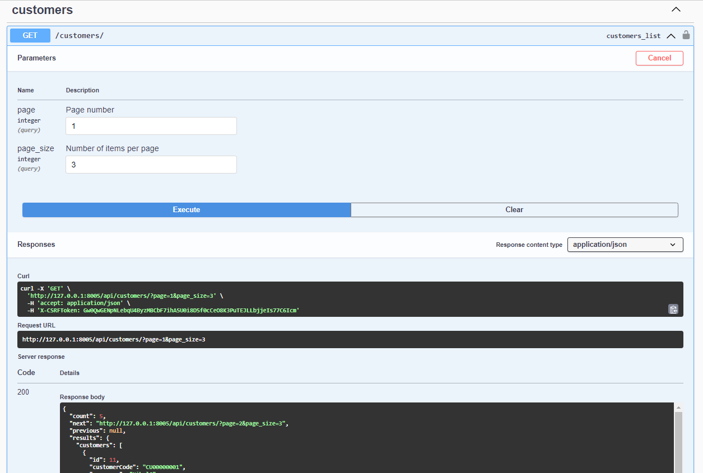

# Auto Company Backend API

## Description

This is the backend API for a Auto Company system. It provides endpoints for managing categories, customers, products, master stock, orders, and order items.

## Setup

**1. Clone the repository:**

   ```bash
   git clone  https://github.com/ncr5630/auto-company-backend
   cd auto-company-backend
   ```
**2. build and run service:**
   ```bash
   docker-compose up --build
   ```


**3. Check if the database tables should be as follows:**


**4. ER Diagram**


###API Documentation
http://127.0.0.1:8000/swagger/  

**5. create sample customer**


**6. get sample customer**
   
we can do other CRUD operation for customer


