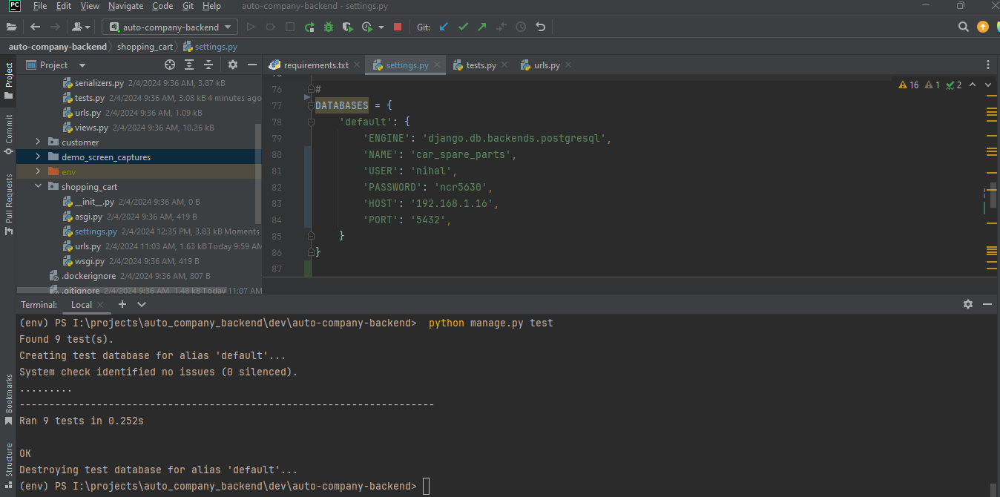

# Auto Company Backend API

## Description

This is the backend API for a Auto Company system. It provides endpoints for managing categories, customers, products, master stock, orders, and order items.

## Setup

**1. Clone the repository:**

   ```bash
   git clone  https://github.com/ncr5630/auto-company-backend
   cd auto-company-backend
   ```
**2. build and run service:**
   ```bash
   docker-compose up --build
   ```


**3. Check if the database tables should be as follows:**


**4. API Documentation**
http://127.0.0.1:8000/swagger/  


**5. Create sample customer**


**6. List all customers**
   
   ***we can do other CRUD operation for customer***


**7. Create root category**

   ```bash
   curl -X 'POST' \
  'http://127.0.0.1/api/categories/' \
  -H 'accept: application/json' \
  -H 'Content-Type: application/json' \
  -H 'X-CSRFToken: TcwUP6QHk9btbV9xUiuSTHKTLfVFIwL4YBAgwDevWaNsQDEnSfyXCzfrCkzjTDTE' \
  -d '{
  "pid": 0,
  "name": "Car Parts",
  "status": "Active"
}'
   ```

**8. Create sample category under root**


   ```bash
   curl -X 'POST' \
     'http://127.0.0.1/api/categories/' \
     -H 'accept: application/json' \
     -H 'Content-Type: application/json' \
     -H 'X-CSRFToken: TcwUP6QHk9btbV9xUiuSTHKTLfVFIwL4YBAgwDevWaNsQDEnSfyXCzfrCkzjTDTE' \
     -d '{
     "pid": 1,
     "name": "Engine Components",
     "status": "Active"
   }'   
   ```
**9. Select all categories**


**10. create sample product under added category**


```text
Hear auto-updating selling prices based on unit cost and profit percentage.

```
```bash
curl -X 'POST' \
  'http://127.0.0.1/api/products/' \
  -H 'accept: application/json' \
  -H 'Content-Type: application/json' \
  -H 'X-CSRFToken: TcwUP6QHk9btbV9xUiuSTHKTLfVFIwL4YBAgwDevWaNsQDEnSfyXCzfrCkzjTDTE' \
  -d '{
  "productName": "Engine Oil Filter",
  "description": "Engine Oil Filter",
  "productUnits": "Number",
  "unitCost": "450",
  "profitPercentage": "35",
  "createdBy": "1",
  "status": "Active",
  "category": 2
}'
```
**11 Select all product list**


**12 Update master stock**


```bash
curl -X 'POST' \
  'http://127.0.0.1/api/masterstock/' \
  -H 'accept: application/json' \
  -H 'Content-Type: application/json' \
  -H 'X-CSRFToken: TcwUP6QHk9btbV9xUiuSTHKTLfVFIwL4YBAgwDevWaNsQDEnSfyXCzfrCkzjTDTE' \
  -d '{
  "totalStock": "200",
  "totalPurchase": "200",
  "lastUpdateBy": "string",
  "category": 2,
  "product": 1
}'
```
**13 Select master stock**


**14 Create order**


```bash
curl -X 'POST' \
  'http://127.0.0.1/api/orders/' \
  -H 'accept: application/json' \
  -H 'Content-Type: application/json' \
  -H 'X-CSRFToken: TcwUP6QHk9btbV9xUiuSTHKTLfVFIwL4YBAgwDevWaNsQDEnSfyXCzfrCkzjTDTE' \
  -d '{
  "order_date": "2024-02-04T06:47:09.964Z",
  "delivery_date": "2024-02-04T06:47:09.964Z",
  "is_ordered": true,
  "customer": 1
}'
```

**15 Add items for order**

```bash
curl -X 'POST' \
  'http://127.0.0.1/api/orders/1/items/' \
  -H 'accept: application/json' \
  -H 'Content-Type: application/json' \
  -H 'X-CSRFToken: TcwUP6QHk9btbV9xUiuSTHKTLfVFIwL4YBAgwDevWaNsQDEnSfyXCzfrCkzjTDTE' \
  -d '{
  "product": 1,
  "quantity": 20
}'
```
**16 Select order id records**


**17 Test Cases running output**



**17 Sample Categories and products for each category**
```text
Root Category : Car Parts
Sub Category under "Car Parts"
1.Engine Components:
    Sample Products:
        Engine Oil Filter
        Spark Plugs
        Air Filter
        Timing Belt
        
2.Brake System Parts:
    Sample Products:
        Brake Pads
        Brake Discs/Rotors
        Brake Calipers
        Brake Fluid
        
3.Suspension and Steering:
    Sample Products:
        Shock Absorbers
        Ball Joints
        Tie Rod Ends
        Control Arms
        
4.Electrical System:
    Sample Products:
        Car Batteries
        Alternators
        Starter Motors
        Ignition Coils
        
5.Transmission and Drivetrain:
    Sample Products:
        Clutch Kit
        Transmission Fluid
        CV Joints
        Drive Belts

6.Exhaust System Components:
    Sample Products:
        Mufflers
        Catalytic Converters
        Exhaust Pipes
        Oxygen Sensors
        
5.Filters and Fluids:
    Sample Products:
        Cabin Air Filters
        Transmission Fluid
        Power Steering Fluid
        Coolant
        
6.Interior and Exterior Accessories:
    Sample Products:
        Car Floor Mats
        Windshield Wipers
        Seat Covers
        Car Air Fresheners
        
7.Lighting and Bulbs:
    Sample Products:
        Headlight Bulbs
        Brake Light Bulbs
        Turn Signal Bulbs
        Fog Lights

8.Tires and Wheels:
    Sample Products:
        All-Season Tires
        Alloy Wheels
        Tire Pressure Monitoring System (TPMS) Sensors
        Wheel Bearings
```
